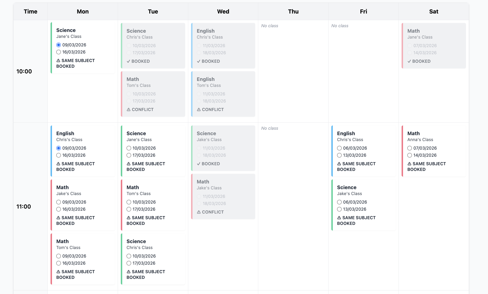
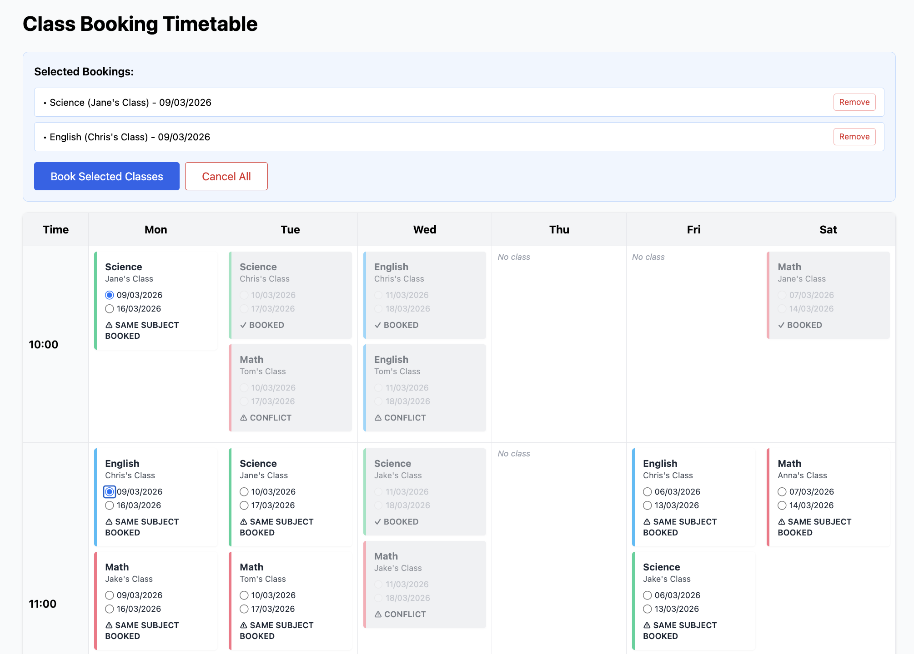
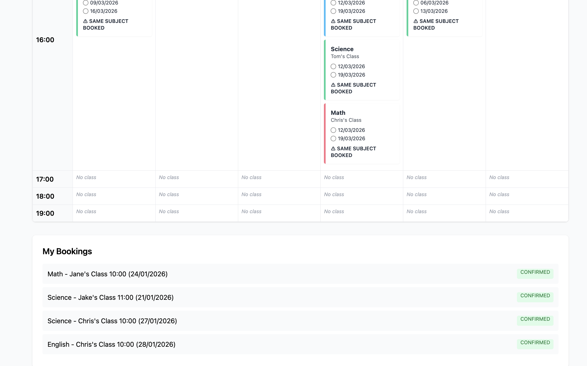
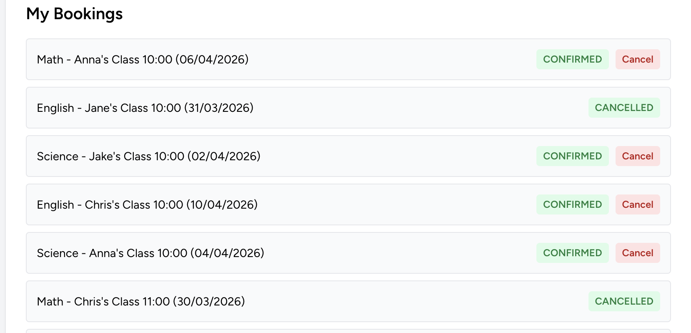

# Class Booking System

A refactored class booking system migrating from a legacy PHP/jQuery implementation to Laravel, with a focus on backend-driven design and concurrency-safe booking workflows.

---

## Project Background

The original system was implemented as a single-page booking interface using plain PHP and jQuery.  
While functional, the architecture relied heavily on client-side state management and lacked clear separation between business rules and persistence logic.

This project revisits the same booking problem with the goal of designing a more maintainable and backend-oriented solution.

---

## Design Goals

-   Manage booking-related business logic and validation consistently with a server-centric approach.
-   Use client-side validation only as a supplementary aid for user experience.
-   Design a booking flow that guarantees data consistency even under concurrent requests.
-   Prioritize clear design documentation and decision rationale over implementation details.

---

## Key Design Decisions

### Hybrid UI Approach

The user interface behaves like a single-page application, but all critical validation and state transitions are handled on the server.

### No Temporary Persistence

Incomplete booking data is not stored in the database.  
Only final submissions result in persisted booking records.

### Concurrency Handling at Submission Time

Class capacity is validated again at submission time to safely handle concurrent booking attempts.

### Payment Excluded

No payment is processed during booking.  
Payments are handled separately after administrative confirmation.

### Single Active Booking Policy

Each student may have only one active booking batch at a time.  
To submit a new booking request, existing bookings must be cancelled first.  
This decision simplifies state management and ensures booking consistency.

---

## System Overview

-   Students can browse and filter class sessions by subject and center
-   Bookings are allowed within a two-week window
-   Multiple centers can be selected with travel time considerations
-   Full classes result in waiting list bookings
-   Students must cancel existing bookings before submitting a new booking request

---

## Documentation

-   [Use Cases](docs/UseCases.md)
-   [Functional Requirements](docs/FR.md)
-   [Technical Requirements](docs/TR.md)
-   [ERD Diagram](docs/diagrams/erd.md)

---

## Technology Stack

-   Backend: Laravel
-   Frontend: React + Inertia.js + Tailwind CSS
-   Database:
    -   SQLite (development & automated tests)
    -   MySQL (production-oriented design)
-   Testing: PHPUnit (planned)
-   API design: Documentation of RESTful endpoint design (TR.md)

---

## Notes

In the original system, booking data was also exported to Google Docs and administrators were notified via Slack.  
These integrations are documented but not fully implemented in this refactored version to keep the focus on core system design.

---

## Status

This project focuses on design-first implementation and iterative refinement.

---
## [Booking Flow](docs/diagrams/booking-flow.md)

- Student accesses the booking page
- System checks for an existing active booking — if found, prompts cancellation first
- Student filters available sessions by subject, centre, and date range (2-week window)
- Student selects sessions — validation enforces no time overlaps and no duplicate subjects
- Student reviews and submits the booking
- System checks capacity:
  - **Available** → booking confirmed
  - **Full** → placed on waiting list
- Notifications sent in both cases

→ [View Booking Flow Diagram](docs/diagrams/booking-flow.md)

---

## [Booking Status Lifecycle](docs/diagrams/booking-state.md)

- `Confirmed` — capacity was available
- `Waiting` — session was full at time of booking
- `Cancelled` — student cancelled (from confirmed or waiting)
- Transitions driven by system logic (capacity checks) and student actions (cancellation)

→ [View Booking Status Lifecycle Diagram](docs/diagrams/booking-state.md)

---

## Screenshots

#### 1. Timetable with availability indicators

The timetable visualises booking availability directly in the UI.

- Booked classes are marked
- Conflicts are highlighted
- Warnings are shown when the same subject is already booked

This helps users understand availability before submitting a booking.

#### 2. Booking Review Panel

Selected classes are displayed in a review panel before submission.
This allows users to quickly verify and modify their selections without navigating away from the page.

#### 3. My Bookings

Users can view their confirmed bookings in a dedicated section, providing clear feedback after the booking process.
They can also directly cancel their existing bookings (with status 'confirmed' or 'waiting') from this list.
