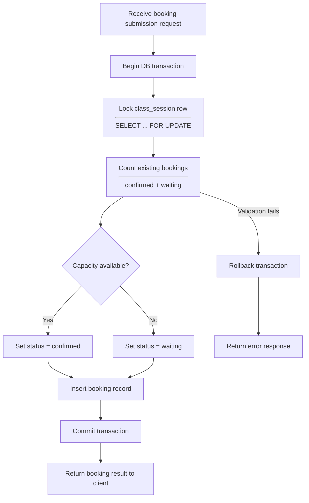

# Booking Transaction Design

This document describes the transactional behavior of the booking submission process,
with a focus on concurrency handling and data consistency.

---

## Goals

- Prevent overbooking under concurrent requests
- Guarantee atomic booking creation
- Ensure deterministic booking status assignment

---

## Transaction Boundary

All booking submissions are processed within a single database transaction.

The transaction starts when a booking submission request is received
and ends after booking records are successfully persisted or rolled back.

---

## High-Level Flow

1. Begin database transaction
2. Lock target class session rows
3. Validate current booking count
4. Determine booking status
5. Create booking records
6. Commit transaction

---

## Concurrency Strategy

- Pessimistic locking is applied to `class_sessions` rows
- `SELECT ... FOR UPDATE` is used to prevent race conditions
- Capacity is validated only after acquiring the lock

---

## Pseudocode (Laravel-Oriented)

```php
DB::transaction(function () use ($student, $selectedSessions) {

    foreach ($selectedSessions as $sessionId) {

        $session = ClassSession::where('id', $sessionId)
            ->lockForUpdate()
            ->first();

        $currentCount = Booking::where('class_session_id', $session->id)
            ->whereIn('status', ['confirmed', 'waiting'])
            ->count();

        if ($currentCount < $session->max_students) {
            $status = 'confirmed';
        } else {
            $status = 'waiting';
        }

        Booking::create([
            'student_id' => $student->id,
            'class_session_id' => $session->id,
            'status' => $status,
        ]);
    }

});
```

---

## Failure Handling

- If any validation fails, the transaction is rolled back

- No partial booking data is persisted

- The client receives a failure response and may retry

---

## Notes

- No locking occurs during intermediate UI steps

- Concurrency is handled only at submission time



## Failure Scenarios & Handling

The booking transaction is designed to fail fast and consistently under invalid or conflicting conditions.  
All failures result in a full transaction rollback unless explicitly noted.

| Scenario                    | Description                                                            | Detection Point                                      | System Behavior                          | Client Response                      |
| --------------------------- | ---------------------------------------------------------------------- | ---------------------------------------------------- | ---------------------------------------- | ------------------------------------ |
| Capacity exceeded           | One or more class sessions are already full for the selected date      | During capacity lock per `(class_session_id + date)` | Booking is created with `waiting` status | Success response with waiting status |
| Duplicate active booking    | Student already has an active booking batch (`confirmed` or `waiting`) | At transaction start when checking existing bookings | Transaction aborted                      | Error prompting cancellation         |
| Concurrent booking conflict | Another transaction fills the last available slot simultaneously       | During row-level lock on capacity rows               | Booking falls back to `waiting`          | Success response with waiting status |
| Partial submission attempt  | Some selected sessions are invalid                                     | Validation before transaction                        | Entire request rejected                  | Validation error                     |
| Invalid date selection      | Selected date is outside booking window                                | Request validation layer                             | Request rejected                         | Validation error                     |

## Transaction Guarantees

- No partial bookings are persisted
- All booking decisions occur inside a single database transaction
- Race conditions are resolved deterministically
- System state remains consistent under concurrent requests

## Design Rationale

Capacity limits are enforced through transaction logic rather than database constraints.  
This approach allows flexible booking states (e.g. waiting list) while maintaining consistency.
