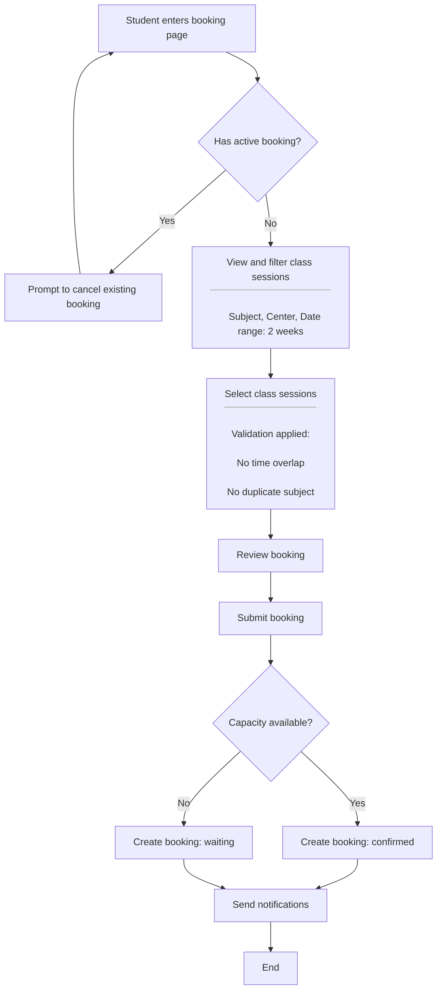

```mermaid
flowchart TD
    A[Student enters booking page] --> B{Has active booking?}

    B -- Yes --> C[Prompt to cancel existing booking]
    C --> A

    B -- No --> D[View and filter class sessions<hr/>
    Subject, Center, Date range: 2 weeks]

    D --> E[Select class sessions<hr/>
    Validation applied:<br/>
    No time overlap<br/>
    No duplicate subject]

    E --> F[Review booking]
    F --> G[Submit booking]

    G --> H{Capacity available?}

    H -- Yes --> I[Create booking: confirmed]
    H -- No --> J[Create booking: waiting]

    I --> K[Send notifications]
    J --> K

    K --> L[End]

```
