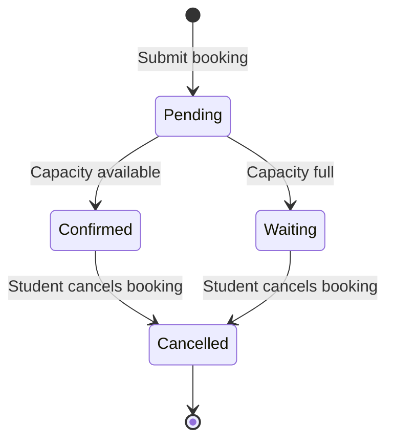

# Booking Status Lifecycle

This document describes the lifecycle and state transitions of a booking entity.

Status Definitions

Pending

- The booking has been submitted by the student.
- Capacity validation has not yet been finalized.
- This is a short-lived, transactional state and is not typically exposed to the user interface.

Confirmed

- Capacity was available at the time of submission.
- The booking is successfully confirmed.
- The student is eligible to attend the class.
- Notification emails are sent to the student and administrators.

Waiting

- The class capacity was full at the time of submission.
- The booking is placed on a waiting list.
- The booking may later transition to Confirmed:
  - manually by an administrator, or
  - automatically if a seat becomes available (future enhancement).

Cancelled

- The student has cancelled an existing booking.
- This state is critical for enforcing the “active booking batch” policy.
- Once cancelled, the student may submit a new booking request.
