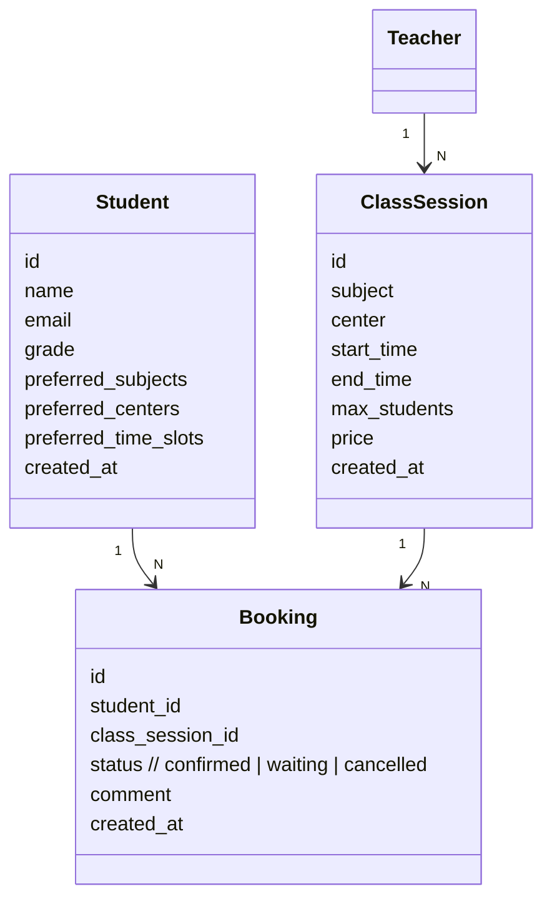

```mermaid
classDiagram
    class Student {
        id
        name
        email
        grade
        preferred_subjects
        preferred_centers
        preferred_time_slots
        created_at
    }

    class ClassSession {
        id
        subject
        center
        start_time
        end_time
        max_students
        price
        created_at
    }

    class Booking {
        id
        student_id
        class_session_id
        status  // confirmed | waiting | cancelled
        comment
        created_at
    }

    Student "1" --> "N" Booking
    ClassSession "1" --> "N" Booking
    Teacher "1" --> "N" ClassSession
```
